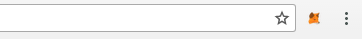
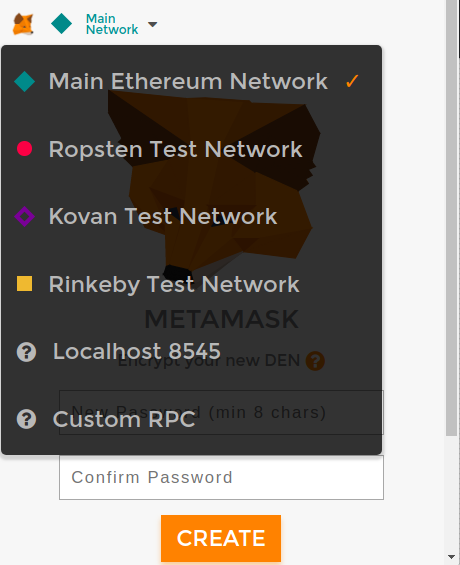
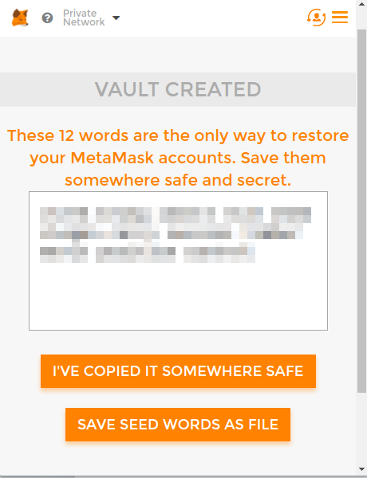
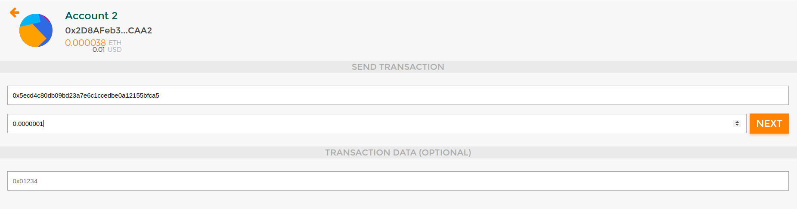

# Using metamask to manage your wallets

Metamask is a browser extension for managing Ethereum Wallets, available on Chrome and Firefox.

# Installing the extension

- **For Chrome**: Install the extension via the [Web Store](https://chrome.google.com/webstore/detail/metamask/nkbihfbeogaeaoehlefnkodbefgpgknn)
- **For Firefox**: Install the add-on via the [Add-ons page](https://addons.mozilla.org/en-US/firefox/addon/ether-metamask/)

After installing the extension, you should have a new icon next to the url bar.

# Using the extension

Here we will use the development network to demonstrate, however it is almost the same when using on other networks.

## Setting Up

Once the extension have been installed, click the newly added metamask icon next to the URL bar on the browser. The metamask UI will show up. Go through the initial process.

Now you might want to change the network to the network you are using metamask for (for our case, the dev network, or localhost:8545)

Create a password for the new DEN. The DEN is basically where you store multiple ethereum accounts using metamask.

After entering your password, **save your seed words somewhere safe**.

The popup UI is pretty buggy for the moment, so from now on, you should open the UI in a new tab instead.

For Chrome: Open `chrome-extension://nkbihfbeogaeaoehlefnkodbefgpgknn/home.html`

For Firefox: Switch to the new UI, press the "Open in Tab button", then *switch back* to the old UI (the new UI is also buggy), save the URL for later uses.

## Importing accounts created via the geth console

Metamask automatically creates a new account when you install the extension. If you want to use accounts created via the geth console in other guides, you can import your account key as JSON file.

For the dev network, the keystore is located in `$HOME/myetherdata/devdata/keystore/<UTC-timestamp>--<account hex>`.

## Using Metamask to send/receive ether

You can use Metamask UI to send ether to other accounts. Simply click "send" and follow the simple UI.

## Using Metamask with the ERC20 Tokens

